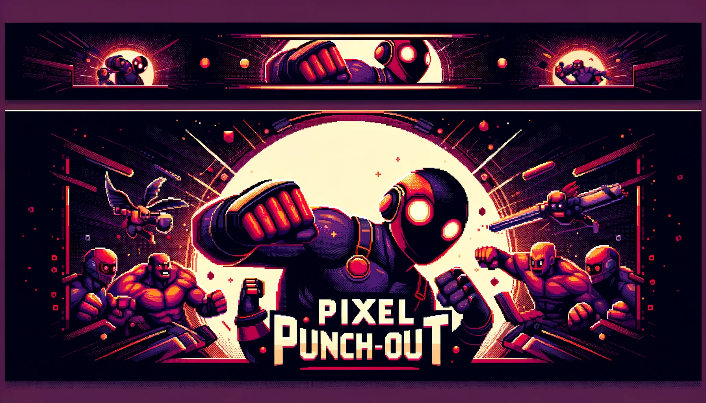

# Pixel Punch-Out Server

Welcome to the **Pixel Punch-Out Server** repository! This server manages player profiles, authentication, and other essential backend services for the Pixel Punch-Out game.


## Table of Contents

- [Introduction](#introduction)
- [Features](#features)
- [Technologies Used](#technologies-used)
- [Getting Started](#getting-started)
- [Usage](#usage)
- [API Endpoints](#api-endpoints)
- [Contributing](#contributing)
- [Contact](#contact)

## Introduction

The Pixel Punch-Out Server is dedicated to handling player profiles, authentication, and other backend functionalities that support the main game logic handled by a separate WebSocket server. Built with Node.js and MySQL, it ensures secure and efficient management of player data.

## Features

- **Player Profiles:** Create and manage player profiles.
- **Authentication:** Secure user login and registration.
- **Profile Interactions:** Comment on player profiles, update profile photos, and more.

## Technologies Used

- **Backend:** Node.js, Express.js
- **Database:** MySQL
- **ORM:** Knex.js

## Getting Started

### Prerequisites

Make sure you have the following installed:

- Node.js
- npm
- MySQL

### Installation

1. **Clone the repository:**
   ```bash
   git clone https://github.com/yigitocak/Pixel-Punch-Out-Server.git
   cd Pixel-Punch-Out-Server
   ```

2. **Install dependencies:**
   ```bash
   npm install
   ```

3. **Set up environment variables:**
   Create a `.env` file in the root directory and add your MySQL connection details and other necessary environment variables.
   ```bash
   DB_HOST=your_mysql_host
   DB_USER=your_mysql_user
   DB_PASSWORD=your_mysql_password
   DB_DATABASE=your_mysql_database
   BACKEND_URL=your_backend_url
   CLOUDINARY_API_KEY=your_cloudinary_api_key
   CLOUDINARY_API_SECRET=your_cloudinary_api_secret
   CLOUDINARY_CLOUD_NAME=your_cloudinary_cloud_name
   DISCORD_CLIENT_ID=your_discord_client_id
   DISCORD_CLIENT_SECRET=your_discord_client_secret
   DISCORD_TOKEN=your_discord_token
   EMAIL=your_website_email
   EMAIL_PASSWORD=your_website_email_password
   GOOGLE_CLIENT_ID=your_google_client_id
   GOOGLE_CLIENT_SECRET=your_google_client_secret
   NODE_ENV=development_production
   SECRET_KEY=your_secret_key
   PORT=your_port_number
   ```

4. **Run the server:**
   ```bash
   npm start
   ```

## Usage

Once the server is running, it will handle player profiles, authentication, and other backend tasks. Connect your front-end or WebSocket server to this backend to utilize these services.

## API Endpoints

### Authentication

- **Authenticate Token:**
  ```http
  GET /auth/ (header) 
  {
    "token": "your_token"
  }
  ```

- **Register:**
  ```http
  POST /auth/signup
  {
    "email": "your_email",
    "username": "your_username",
    "password": "your_password"
  }
  ```

- **Login:**
  ```http
  POST /auth/login
  {
    "username": "your_username",
    "password": "your_password"
  }
  ```

- **Verify:**
  ```http
  POST /auth/verify
  {
    "email": "your_email",
    "code": "your_code"
  }
  ```

- **Reset:**
  ```http
  POST /auth/reset
  {
    "email": "your_email"
  }
  ```

- **Validate Reset:**
  ```http
  POST /auth/validateReset
  {
    "email": "your_email",
    "code": "your_code"
  }
  ```

- **Reset Password:**
  ```http
  POST /auth/resetPassword
  {
    "email": "your_email",
    "newPassword": "your_new_password",
    "secret": "your_secret"
  }
  ```

### Profiles

- **All Profiles:**
  ```http
  GET /profiles/
  ```

- **Fetch Specific User With ID:**
  ```http
  GET /profiles/id/:id
  ```

- **Fetch Specific User:**
  ```http
  GET /profiles/:username
  ```

- **Change Username:**
  ```http
  POST /profiles/username
  {
    "newUsername": "your_new_username"
  }
  ```

- **Upload Photo:**
  ```http
  POST /profiles/:username/uploadPhoto
  {
    "file": "your_profile_photo"
  }
  ```

- **Delete Profile:**
  ```http
  DELETE /profiles/:username
  ```

- **Increment Wins:**
  ```http
  POST /profiles/:username/wins
  {
    "secret": "your_secret"
  }
  ```

- **Increment Losses:**
  ```http
  POST /profiles/:username/losses
  {
    "secret": "your_secret"
  }
  ```

- **Post Comment:**
  ```http
  POST /profiles/:username/comments
  {
    "commentUsername": "your_username",
    "comment": "your_comment"
  }
  ```

- **Delete Comment:**
  ```http
  DELETE /profiles/:username/comments/:commentId
  ```

### Leaderboard

- **Leaderboard:**
  ```http
  GET /leaderboard
  ```

### Discord

- **User Discord Data:**
  ```http
  POST /discord/getuserData
  {
    "discordId": "your_discord_id"
  }
  ```

- **User Discord Verify:**
  ```http
  GET /discord/verify
  ```

- **User Discord Verify Callback:**
  ```http
  GET /discord/verify/callback
  ```

- **User Discord OAuth Login:**
  ```http
  GET /discord/oauth/login
  ```

### OAuth

- **Google Callback:**
  ```http
  POST /oauth/google/callback
  {
    "token": "your_token"
  }
  ```

## Contributing

We welcome contributions! Here’s how you can help:

1. **Fork the repository.**
2. **Create a new branch:** `git checkout -b feature/your-feature`
3. **Commit your changes:** `git commit -m 'Add some feature'`
4. **Push to the branch:** `git push origin feature/your-feature`
5. **Create a Pull Request.**

## Contact

Have questions or feedback? Let’s connect!

- **Yigit Ocak:** [LinkedIn](https://www.linkedin.com/in/yigitocak/) - [Email](mailto:yigitockk@gmail.com)
- **Owen Orcan:** [LinkedIn](https://www.linkedin.com/in/owenorcan/) - [Email](mailto:owenorcan@gmail.com)

  
